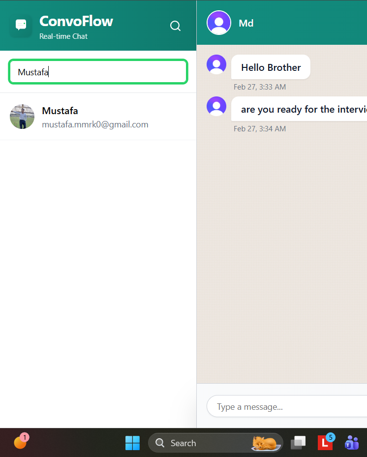

# ConvoFlow - Real-time Chat Application

A modern, WhatsApp-inspired real-time chat application built with Next.js, Convex, and Clerk authentication.

## ✨ Features

- 💬 Real-time messaging with instant delivery
- 👥 User search and conversation management
- 🟢 Online/offline status indicators
- ⌨️ Live typing indicators with animations
- 🔔 Unread message badges with counts
- 🗑️ Soft delete messages
- 📱 Fully responsive mobile design
- 🎨 WhatsApp-inspired UI with smooth animations
- 🔐 Secure authentication with Clerk
- 🔄 Automatic user sync via webhooks
- 📊 Smart scroll with "New messages" toast

## 📸 Screenshots





## 🛠️ Tech Stack

- **Frontend**: Next.js 16 (App Router), TypeScript, Tailwind CSS v4
- **Backend**: Convex (real-time database & serverless functions)
- **Authentication**: Clerk
- **UI Components**: shadcn/ui
- **Animations**: Custom CSS keyframes + Tailwind

## 🚀 Getting Started

### Prerequisites

- Node.js 18+ 
- npm or yarn
- Convex account (free at [convex.dev](https://convex.dev))
- Clerk account (free at [clerk.com](https://clerk.com))

### Installation

1. **Clone the repository**
   ```bash
   git clone <your-repo-url>
   cd convoflow
   ```

2. **Install dependencies**
   ```bash
   npm install
   ```

3. **Set up Convex**
   ```bash
   npx convex dev
   ```
   - This will open your browser to create/link a Convex project
   - Copy the deployment URL provided

4. **Set up Clerk**
   - Create a new application at [dashboard.clerk.com](https://dashboard.clerk.com)
   - Copy your publishable key and secret key

5. **Configure environment variables**
   ```bash
   cp .env.example .env.local
   ```
   
   Edit `.env.local` with your actual values:
   ```env
   CONVEX_DEPLOYMENT=your-deployment-name
   NEXT_PUBLIC_CONVEX_URL=https://your-deployment.convex.cloud
   NEXT_PUBLIC_CLERK_PUBLISHABLE_KEY=pk_test_xxxxx
   CLERK_SECRET_KEY=sk_test_xxxxx
   CLERK_WEBHOOK_SECRET=whsec_xxxxx
   ```

6. **Set up Clerk Webhook** (for user sync)
   - In Clerk Dashboard → Webhooks → Add Endpoint
   - For local dev: `http://127.0.0.1:3210/clerk-webhook`
   - For production: `https://your-deployment.convex.cloud/clerk-webhook`
   - Subscribe to: `user.created`, `user.updated`, `user.deleted`
   - Copy the signing secret to `CLERK_WEBHOOK_SECRET`
   
7. **Set webhook secret in Convex**
   ```bash
   npx convex env set CLERK_WEBHOOK_SECRET "whsec_xxxxx"
   ```

8. **Run the development server**
   ```bash
   npm run dev
   ```

9. **Open [http://localhost:3000](http://localhost:3000)**

## 📁 Project Structure

```
convoflow/
├── convex/                 # Convex backend
│   ├── schema.ts          # Database schema
│   ├── users.ts           # User queries & mutations
│   ├── conversations.ts   # Conversation management
│   ├── messages.ts        # Message CRUD operations
│   ├── typing.ts          # Typing indicators
│   ├── unread.ts          # Unread message tracking
│   └── http.ts            # Webhook endpoints
├── src/
│   ├── app/
│   │   ├── (chat)/        # Chat UI components
│   │   │   ├── chat-area.tsx
│   │   │   ├── sidebar.tsx
│   │   │   ├── conversation-list.tsx
│   │   │   ├── message-bubble.tsx
│   │   │   └── ...
│   │   ├── sign-in/       # Auth pages
│   │   ├── sign-up/
│   │   ├── animations.css # Custom animations
│   │   └── layout.tsx
│   └── components/ui/     # shadcn components
└── public/                # Static assets
```

## 🎨 Key Features Explained

### Real-time Messaging
Messages are delivered instantly using Convex subscriptions. No polling required!

### User Sync
Clerk webhooks automatically sync user data (name, email, image) to Convex when:
- New user signs up
- User updates profile
- User is deleted

### Online Status
Updates when users:
- Sign in/out
- Send messages
- Navigate away from the app

### Smart Scroll
- Auto-scrolls to bottom for new messages when already at bottom
- Shows "New messages" toast when scrolled up
- Click toast to jump to latest messages

## 🚀 Deployment

### Deploy to Vercel

1. **Create production Convex deployment**
   ```bash
   npx convex deploy
   ```
   Copy the production URL

2. **Push to GitHub**
   ```bash
   git add .
   git commit -m "Initial commit"
   git push origin main
   ```

3. **Deploy on Vercel**
   - Import your GitHub repository
   - Set environment variables (see `.env.example`)
   - Deploy!

4. **Update Clerk webhook**
   - Change endpoint URL to production Convex URL
   - `https://your-prod-deployment.convex.cloud/clerk-webhook`

## 🔒 Security

- Environment variables are gitignored (`.env.local`)
- Clerk handles authentication securely
- Webhook signatures are verified with `svix`
- No sensitive data in client-side code

## 📝 License

MIT

---

Built with ❤️ for real-time communication
